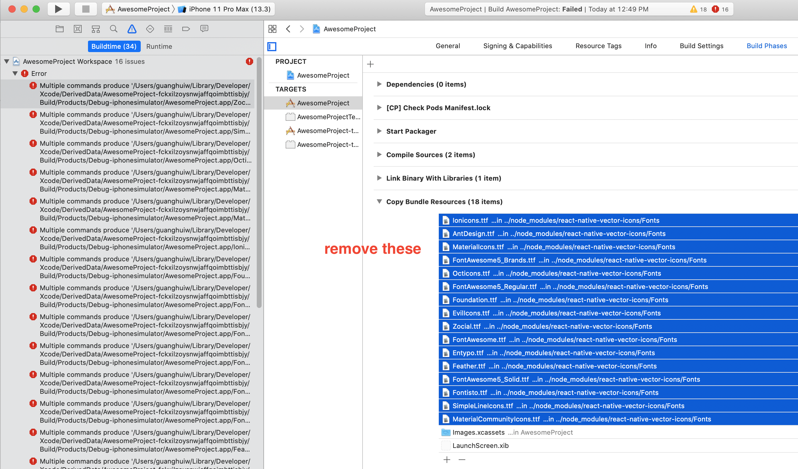

# Guidance

Whenever installing any npm package, run `pod install` in ios folder.

## Installation Issues in China

ios/Podfile

```diff
+ source 'https://mirrors.tuna.tsinghua.edu.cn/git/CocoaPods/Specs.git'

platform :ios, '9.0'
require_relative '../node_modules/@react-native-community/cli-platform-ios/native_modules'

target 'AwesomeProject' do
+  pod 'boost-for-react-native', :git => 'https://gitee.com/damon-s/boost-for-react-native.git'
```

## Run application

```bash
# ios run

cd AwesomeProject
yarn ios

# 或者
yarn react-native run-ios

# 用 xcode 打开 ios/AwesomeProject.xcworkspace
```

```bash
# android run

cd AwesomeProject
yarn android
# 或者
yarn react-native run-android
```

## Use font awesome and other vector

refer

- <https://github.com/oblador/react-native-vector-icons>
- <https://medium.com/@vimniky/how-to-use-vector-icons-in-your-react-native-project-8212ac6a8f06>
- <https://github.com/oblador/react-native-vector-icons/issues/1074>



After removing those, xcode runs `shift + cmd + k` clean build and `cmd + b` build again.

```bash
yarn add react-native-vector-icons  # https://oblador.github.io/react-native-vector-icons
```

## Screenshots

<div>
  
  
</div>
